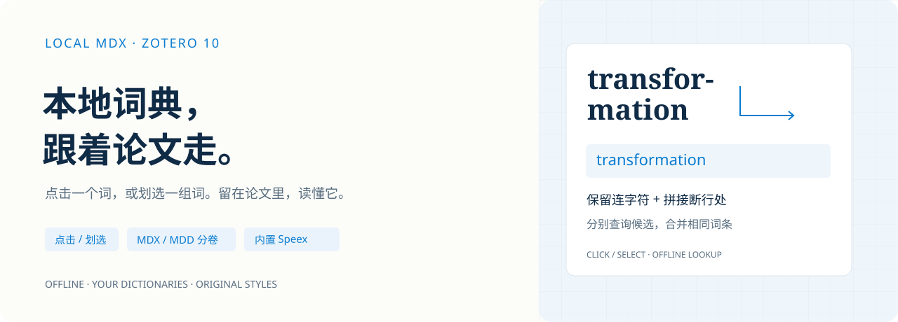

<p align="center">
  
</p>

<h1 align="center">Local MDX · 本地 MDX 点击与划选查词</h1>

<p align="center">留在论文里，用你自己的词典。</p>

<p align="center">
  <a href="https://github.com/Noahxie83/zotero-local-mdx-click/releases/tag/v1.1.2"></a>
  
  <a href="https://github.com/Noahxie83/zotero-local-mdx-click/actions/workflows/build.yml"></a>
  <a href="LICENSE"></a>
</p>

<p align="center">
  <a href="https://github.com/Noahxie83/zotero-local-mdx-click/releases/download/v1.1.2/local-mdx-click-1.1.2.xpi"><b>下载安装包</b></a> ·
  <a href="https://noahxie83.github.io/zotero-local-mdx-click/">交互示例</a> ·
  <a href="docs/USER_GUIDE.md">完整指南</a> ·
  <a href="docs/RESTORE.md">复原教程</a> ·
  <a href="docs/CHANGES.md">全部功能变更</a>
</p>

---

在 Zotero 10.0 系列 PDF 阅读器中，**单击单词，或划选一个词/词组，查询本地 MDX 词典**。自行选择文件夹、切换词典，读取配套 MDD 分卷或外置资源，保留每部词典自己的排版。词条和发音在本机处理，无需翻译账号。

## 五个值得试的功能

| 功能 | 使用场景 |
| --- | --- |
| **通用 MDX / MDD 分卷** | 选择任意词典目录，列出全部 MDX；同名 `.mdd`、`.1.mdd`、`.2.mdd`、`.10.mdd` 按数字关联，可手动添加其他名称/目录的资源包。 |
| **每部词典，自己的排版** | 按实际 HTML/CSS 引用加载图片、字体和样式；不把所有词典套成同一模板。需要简洁阅读时一键切换文字模式。 |
| **把断行词选完整，再查询** | `transfor-` 换行 `mation` 同时尝试 `transfor-mation` 和 `transformation`；真实复合词保留原写法，词组保留空格。 |
| **查词与批注，在一个菜单** | 划选后在同一弹窗查看词条、选择 8 色、保存高亮或下划线，避免两个菜单覆盖。设置可恢复 Zotero 自带菜单。 |
| **SPX / Speex 离线发音** | 内置解码器，从 MDD 或外置资源读取标准 Ogg/SPX 并转 WAV；无需 ffmpeg、Python 或另装解码程序。 |

## 看几个例子

**[打开在线交互示例 →](https://noahxie83.github.io/zotero-local-mdx-click/)** · [下载单文件 HTML，离线打开](https://github.com/Noahxie83/zotero-local-mdx-click/releases/download/v1.1.2/local-mdx-click-demo-1.1.2.html)

| 示例 | 可以操作什么 |
| --- | --- |
| 01 · 单击 `network` | 点击阅读区词语，在词典下拉框切换“研究英语”和“简明双语”，观察不同 CSS、图片和分卷资源。 |
| 02 · 划选 `transfor-` / `mation` | 查看两种候选分别命中、相同释义合并；演示图中的断行文本可以完整选中。 |
| 03 · 划选 `neural network` | 查询完整词组，查看合并菜单的颜色、高亮与下划线。 |

示例使用**自制 MDX/MDD 和插件真实解析、排版组件**，不包含用户商业词典。网页批注按钮只演示类型与颜色，不写入 Zotero；试听音频是自制提示音，不是单词发音。安装插件后才会查询自己的词典并保存文献批注。

## 三步开始

1. **安装**：下载 [1.1.2 XPI](https://github.com/Noahxie83/zotero-local-mdx-click/releases/download/v1.1.2/local-mdx-click-1.1.2.xpi)。Zotero → 工具 → 插件 → 齿轮 → 从文件安装插件，完成后重启。
2. **选择词典**：设置 → 本地 MDX 点击查词 → 选择词典文件夹，或直接选择 MDX。下拉框选择当前词典。
3. **开始阅读**：打开有文字层的 PDF，普通指针单击英文词，或拖选完整单词/词组后松开鼠标。需要批注时再点击高亮/下划线。

已有版本可覆盖安装，原词典/资源设置保留。工具栏“本地词典 ✓”可开关功能，右键换目录；用 ×、Esc、点击外部或滚动 PDF 关闭词条。安装前已打开的 PDF 可重开标签。

### 词典从哪里找？

用户推荐在 **[PDAWiki · MDict 专区](https://www.pdawiki.com/forum/forum.php?gid=7)** 搜索所需的 MDX 词典及配套资源，下载时遵循帖子与词典作者的授权说明。插件本身不附带词典，也不会自动下载或上传词典。

下载后，保留配套的 MDD 分卷、CSS、图片、图标和字体的目录结构，再在插件中选择该目录。只拿到 MDX 而遗漏资源，可能有释义但没有原样式、图片或发音。文件名不同的 MDD 可手动添加。

```text
YourDictionaries/
  Study.mdx
  Study.mdd
  Study.1.mdd
  Study.2.mdd
  Study.10.mdd
  style.css
  images/
  fonts/
```

这些文件名仅说明通用规则，插件没有固定词典名、资源前缀或用户路径。MDX 列表只扫描当前层；资源可位于子目录。查询时只使用选中的一部词典。

## 改过哪些功能，怎么复原？

[**完整变更清单**](docs/CHANGES.md) 逐项列出从 0.1.0 到 1.1.2 的新增与修复；[**复原教程**](docs/RESTORE.md) 包含菜单、查词、排版、资源关联、历史版本及共存设置。

| 想恢复的行为 | 操作 |
| --- | --- |
| Zotero 自带划选菜单 | 设置 → 划选菜单 → **Zotero 自带菜单**。暂停划选自动查询，普通单击查词保留。 |
| 只关闭划选自动查询 | 取消“划选单词或词组后自动查询”；插件批注工具仍可用。 |
| 全部暂停，恢复原阅读操作 | 关闭“启用本地查词”，或点击工具栏开关；也可在插件管理器停用。 |
| 以前的简洁文字样式 | 显示方式 → **简洁文字排版**；改回“词典原有排版”可重新加载原样式。 |
| 原来的自动 MDD 关联 | 选择当前词典 → **恢复自动关联**，清除该词典手动资源配置；不会删除文件。 |
| 更换/替换后重新读取 | 选择原目录或 MDX，再点“刷新词典列表”。 |
| 某个历史插件版本 | 从 [Releases](https://github.com/Noahxie83/zotero-local-mdx-click/releases) 下载对应 XPI，按 [回退教程](docs/RESTORE.md#回退到历史插件版本) 安装。 |

关闭、停用或卸载会恢复插件包装的菜单回调，已保存的 Zotero 批注保留，本地词典文件不删除。若另有点击查询扩展，同时弹窗时可在其中一个扩展关闭相应触发方式。

## 1.1.2 修复与验证

根据代码审查修复 **LZO 精确边界、合法别名循环误判、目录扫描失败丢失当前选择、资源来源报错阻断回退、Speex 累计时长**。普通音频首次只读一次，MDD 增加有界定位/缺失缓存与统计；修改资源配置保留未变化的 MDX 索引。

- **33/33 自动化回归通过**，包含 MDX/MDD、LZO、CSS、资源回退/取消/缓存、划选、批注适配和 Speex。
- **Zotero 10.0.3 独立文献库验收通过**：高亮/下划线保存，重开保留，类型/颜色/文本/位置核对，只读按钮，分屏菜单，自带菜单恢复和停止插件后的清理。
- [GitHub CI](https://github.com/Noahxie83/zotero-local-mdx-click/actions/workflows/build.yml) 执行测试与构建。[证据与覆盖范围](docs/REVIEW_FIXES_1.1.2.md)

真实词典发音播放、全部第三方私有格式及所有扩展组合尚未全面实测；示例和已通过用例不代表所有词典都已兼容。

## 支持范围

| 项目 | 当前范围 |
| --- | --- |
| 阅读器 | Zotero **10.0 系列** PDF；扫描文献需 OCR 文字层 |
| MDX / MDD | 1.x、2.x；raw/zlib/LZO；2.x `Encrypted=2` 索引混淆 |
| 查询 | 大小写配置、内部别名、重复词目、跨块；至多 3 个连字符候选 |
| 划选 | 规范化后最多 256 字符、16 个词；长选区仍可批注 |
| 资源 | 原 HTML/CSS、导入样式、图片、字体、背景和本地音频，按需读取 |
| Speex | 标准 Ogg/SPX，单/双声道、多帧；单文件累计最多 30 秒，输入 8 MB |

词典脚本、远程资源和在线翻译接口不运行或加载；脚本驱动的折叠、统计和特殊控件可能缺失。暂不支持 MDX/MDD 3、密码解密、StyleSheet 反引号宏与词形自动还原；词形依赖词典自带跳转。资源提示不等于“整个词典太大读不完”，可悬停查看具体缺失项再补资源。

更多编码、资源查找顺序、大小限额和兼容性见 [完整指南](docs/USER_GUIDE.md)、[资源设计](docs/RESOURCE_SUPPORT.md)、[Speex 说明](docs/SPEEX_AUDIO.md)。

## 历史与开发

从 0.1.0 到 1.1.2 的 [标签和 Releases](https://github.com/Noahxie83/zotero-local-mdx-click/releases) 保留各版对应源码快照、安装包和原说明。1.1.2 为最新稳定版，只有一个带解码器的安装包。[版本记录](docs/RELEASE_PLAN.md) · [详细发布说明](RELEASE_NOTES.md)

需要 Node.js 开发；**插件运行无需 Node.js 或 Python**。

```powershell
npm ci --ignore-scripts
npm test
npm run build
npm run pack:source
# 可选：重新生成独立 HTML 示例
node scripts/build-showcase.mjs
```

项目采用 **GPL-3.0-or-later**，第三方许可见 [THIRD_PARTY.md](THIRD_PARTY.md)。这是独立开发的 Zotero 插件，非 Zotero 官方产品，也不是 Hover Translate Eudic 的修改版。
